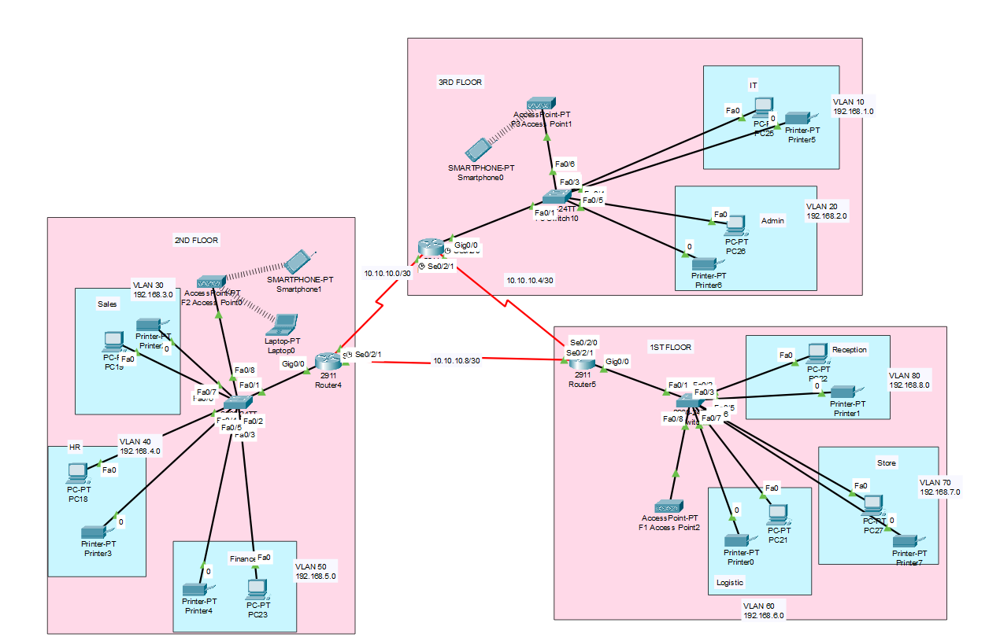

# Cisco-packet-tracer-projects



A brief description of what this project does and who it's for

# Vic Modern Hotel Network Design

A multi-floor enterprise network simulation built in Cisco Packet Tracer for a hotel environment, featuring VLAN segmentation, inter-VLAN routing, OSPF, DHCP, and secure remote access.

## 📋 Project Overview

This project designs and implements a complete network for **Vic Modern Hotel**, a three-floor establishment with multiple departments per floor. The network ensures full connectivity between all devices, dynamic IP allocation, and secure administrative access.

### Floor & Department Breakdown

| Floor | Department | VLAN | Network |
|-------|------------|------|---------|
| 1st Floor | Reception | 80 | 192.168.8.0/24 |
| 1st Floor | Store | 70 | 192.168.7.0/24 |
| 1st Floor | Logistics | 60 | 192.168.6.0/24 |
| 2nd Floor | Finance | 50 | 192.168.5.0/24 |
| 2nd Floor | HR | 40 | 192.168.4.0/24 |
| 2nd Floor | Sales/Marketing | 30 | 192.168.3.0/24 |
| 3rd Floor | Admin | 20 | 192.168.2.0/24 |
| 3rd Floor | IT | 10 | 192.168.1.0/24 |

---

## ⚙️ Features Implemented

- **Three Routers (per floor)** — connected via serial DCE cables
- **Router-to-Router Networks** — `10.10.10.0/30`, `10.10.10.4/30`, `10.10.10.8/30`
- **One Switch per Floor** — placed on respective floors
- **WiFi Networks** — accessible to laptops and smartphones
- **Department Printers** — one printer per department
- **VLAN Segmentation** — each department isolated into its own VLAN
- **OSPF Routing Protocol** — advertises routes between floors
- **DHCP Servers** — each router configured as DHCP server for its floor
- **Full Interconnectivity** — all devices can communicate across the network
- **SSH Remote Access** — enabled on all routers
- **Test-PC** — in IT department (port fa0/1) for SSH testing

---

## 📂 Network Topology Highlights

### 1st Floor (Switch: SW2)
- VLAN 60 — Logistics
- VLAN 70 — Store  
- VLAN 80 — Reception

### 2nd Floor (Switch: SW0)
- VLAN 30 — Sales
- VLAN 40 — HR
- VLAN 50 — Finance

### 3rd Floor (Switch: SW3)
- VLAN 10 — IT
- VLAN 20 — Admin
- Access Point for WiFi (laptops/smartphones)

---

## 🔧 Device Configuration Summary

| Device | Role | Key Config |
|--------|------|-------------|
| Router 0 (F1) | Floor 1 Gateway | DHCP pools (Reception, Store, Logistics), OSPF, SSH |
| Router 1 (F2) | Floor 2 Gateway | DHCP pools (Finance, HR, Sales), OSPF, SSH |
| Router 2 (F3) | Floor 3 Gateway | DHCP pools (IT, Admin), OSPF, SSH |
| SW0 | Floor 2 Switch | VLANs 30/40/50, trunk ports |
| SW2 | Floor 1 Switch | VLANs 60/70/80, trunk ports |
| SW3 | Floor 3 Switch | VLANs 10/20, trunk ports |
| Access Point | 3rd Floor WiFi | WPA2-PSK authentication |

---

## 🚀 Testing & Verification

### SSH Remote Login (from Test-PC)
```bash
C:\>ssh -l gtech 10.10.10.5
Password: gtech
Fl-router>
